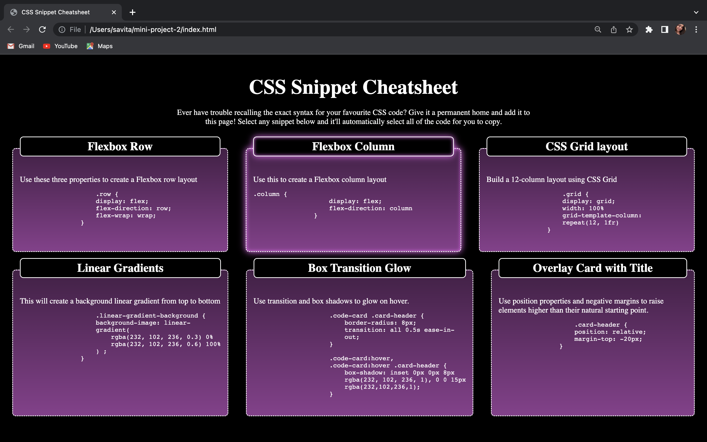

# mini-project-2

CSS Snippet Cheatsheet

## Description

This CSS Cheatsheet contains common style snippets like: Flexbox Row, Flexbox Column, CSS Grid Layout, Linear Gradient, Box Transition Glow, Overlay Card with title. I build this CSS Snippet Cheatsheet so that I can easily access the exact syntax to my favourite CSS Codes.

## Installation 
N/A

## Usage
Can easily copy the CSS Code from this cheatsheet. 

 